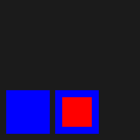

# Survival Painter (One Liner Drawing Tool)


## 概要
テキストベースの直感的な座標系を用いて、図形を「実証的」に描画する軽量ツール

## About
Survival Painter (SPC) は、円や矩形といった図形を、限りなく少ない記述量と簡潔な命令のみで描画できるように設計されています。
GUIツールを立ち上げるまでもない「ちょっとした図案」を、テキストエディタだけで構築するための、エンジニア向けのドローイングツールです。

## 環境
- cargo 1.95.0 on Fedora 44 (6.19.14-300)

## 構築とインストール

```bash
$ cargo install --git https://github.com/mkatase/spc.git
```

## 特徴
− 原点は左下
- 簡潔で少ない記述量

## 注意すべき点
- 描画は、ファイルの上から下へ順に処理(上書き)されます。

## 出力形式
- png
- webp
- svg

## 使用フォント(TE用)
- Noto Sans (by Google)

## 実行モード
| モード| 説明                            |
|:------|:--------------------------------|
| check | データの構文チェック            |
| view  | 画像のプレビュー表示            |
| run   | 画像の出力(webp/png)            |
| image | 画像の出力(低負荷/一部制限あり) |
| svg   | SVGファイルの出力               |

## 例題
以下の例は、[例題一覧](./docs/book-jp/Examples.md)から抜粋されたものです。

1. [少ない記述量（円）](#usage1)
2. [見易く（円）](#usage2)
3. [上書き](#usage3)

### <a id="usage1"></a>少ない記述量（円）
```bash
$ cat data/minimal_circle.dat 
CI,200,200,40
```

** It's hard to see... **
### <a id="usage2"></a>見易く（円）
```bash
$ $ cat data/easy2see.dat 
CI,200,200,40,white,2.0
```

### <a id="usage3"></a>シングルファイル・チェック
```bash
$ cat data/overlay.dat 
...
#
RE,20,20,40,40,red,1.0,red
RE,10,10,60,60,blue,1.0,blue
# move x-axis
RE,80,10,60,60,blue,1.0,blue
RE,90,20,40,40,red,1.0,red
```

- 左の図は、青い四角が上書きされています
- 右の図は、赤い四角が上書きされています
## ブック作成
```bash
$ cd docs
$ mdivide -l en -f ./filelist.txt -d book-en
$ mdivide -l en -i ./orig/book.toml -o ./book-en/book.toml
$ mdivide -l jp -f ./filelist.txt -d book-jp
$ mdivide -l jp -i ./orig/book.toml -o ./book-jp/book.toml
```
## 備考
- 本ファイルは、mdivideにて生成。元ファイルは、[こちら](./docs/README.txt)。
## ChangeLog
- ChageLog is [Here](./CHANGELOG.md)
## License
- License is [MIT](./LICENSE)
## 🎧 B.G.M.
- [微笑みがえし(1978)/キャンディーズ](https://www.youtube.com/watch?v=_xpctqiEH7g)
